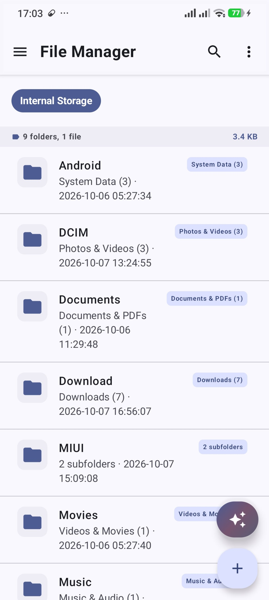
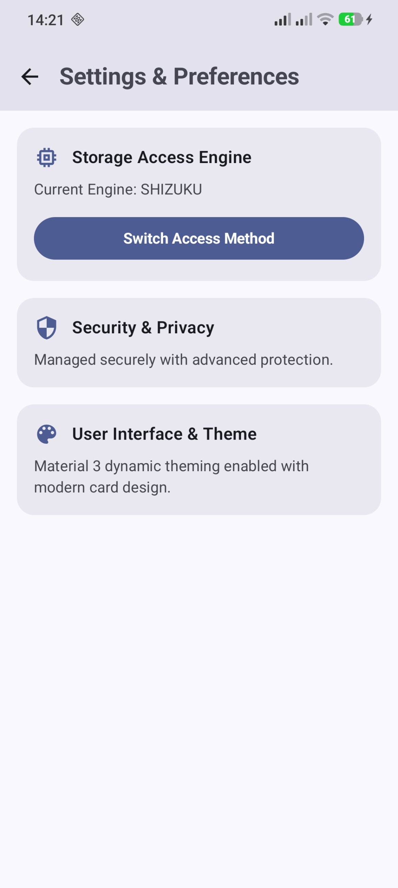

# File Manager

**A clean, modern file manager for Android, built with Kotlin and Jetpack Compose.**

Choose how the app reaches your files: full access through **Shizuku** or **root**,
or no extra setup at all with the **Storage Access Framework (SAF)**. Your choice is
remembered, and you can switch at any time.

  
  &nbsp;&nbsp;
  

## Table of contents

- [Features](#features)
- [Access engines](#access-engines)
- [Quick start](#quick-start)
- [Troubleshooting](#troubleshooting)
- [Architecture](#architecture)
- [Known limitations](#known-limitations)
- [Contributing](#contributing)
- [License](#license)

## Features

- Browse folders and files on internal storage
- Create folders and files
- Rename, delete, copy, and move items
- Three access engines: Shizuku, root, and SAF
- Remembers your engine choice and granted folder between launches
- Switch access methods at any time from the browser's ⋮ menu

## Access engines

| Engine  | What you need                          | What it can reach                              |
|---------|----------------------------------------|------------------------------------------------|
| Shizuku | Shizuku running (ADB or root pairing)  | The full filesystem, as the `shell` user (UID 2000) |
| Root    | A rooted device (Magisk or similar)    | The full filesystem, via `su`                  |
| SAF     | Nothing                                | Only the single folder you grant access to     |

**Shizuku** runs commands through the Shizuku service (`ShizukuFileEngine`, using
`ShizukuManager`). Recent Shizuku versions no longer expose `newProcess` as public
API, so `ShizukuManager` calls it via reflection.

**SAF** needs no root or Shizuku. You pick one folder with `OpenDocumentTree`, and
all operations go through `DocumentFile`. It can't browse outside the folder you
granted, but it works on every device.

**Not sure which to pick?** Choose SAF for casual use. Choose Shizuku or root if
you need access to folders outside the standard storage areas.

## Quick start

**Requirements**

- Android Studio Koala or newer
- An Android device, with Shizuku or root if you want full access (SAF needs neither)

**Build and run**

1. Open the project in Android Studio and let Gradle sync.
2. Run the app on your device.
3. On first launch, choose an access engine:
   - **Shizuku:** start Shizuku first (ADB or root pairing), then grant the permission prompt.
   - **Root:** make sure the device is already rooted. The app will request the grant itself.
   - **SAF:** pick a folder when prompted. No setup needed.
4. To switch engines later, open the ⋮ menu in the top bar and tap **Switch access method…**.

## Troubleshooting

| Problem | Fix |
|---------|-----|
| Stuck on the Shizuku screen | Start Shizuku (ADB or root pairing), then return to the app and grant permission. |
| Root permission never appears | Confirm the device is rooted and that your root manager (for example Magisk) allows this app. |
| SAF only shows one folder | This is expected. SAF can only access the folder you granted. Switch to Shizuku or root for broader access. |
| Want to change the engine | Open the ⋮ menu and tap **Switch access method…**. |

## Architecture

| File | Role |
|------|------|
| `fs/engine/FileEngine.kt` | Shared interface (`list`, `mkdir`, `createFile`, `delete`, `rename`, `copy`, `move`, `parentPath`) implemented by all engines. Paths are opaque per engine: raw filesystem paths for Shizuku/Root, document Uri strings for SAF. |
| `fs/engine/ShizukuFileEngine.kt`, `RootFileEngine.kt` | Thin wrappers around shell commands (`ls -la --full-time`, `mkdir`, `rm -rf`, `mv`, `cp -r`), parsed by the shared `LsParser`. |
| `fs/engine/SafFileEngine.kt` | Caches `DocumentFile` objects by Uri string so navigation and rename/delete/move can look nodes up again, since SAF doesn't support path string math. Move tries `DocumentsContract.moveDocument` first and falls back to copy + delete. |
| `fs/engine/EnginePrefs.kt` | SharedPreferences storing the chosen engine and, for SAF, the granted tree Uri. |
| `ui/EngineSelectionScreen.kt` | First-run choice between the three engines. |
| `ui/ShizukuGateScreen.kt`, `RootGateScreen.kt`, `SafPickerScreen.kt` | Per-engine "not ready yet" screens: waiting for Shizuku permission, waiting for root grant, or prompting for a SAF folder. |
| `ui/FileBrowserViewModel.kt` | Engine-agnostic. Takes a `FileEngine` through `FileBrowserViewModel.Factory` and drives all state from the interface. |
| `MainActivity.kt` (`AppRoot`) | Reads the saved engine choice, shows the right gate screen until that engine is ready, then passes a live `FileEngine` to `FileBrowserScreen`. |

## Known limitations

1. **No file preview or "open with".** Tapping a file only selects it. The selection state (`state.selected`) exists in the ViewModel but the UI doesn't use it yet.
2. **No search, multi-select, or batch actions.**
3. **No permissions editor** (chmod).
4. **SAF copy and move are slow for large folders.** They run file by file with no progress indicator.
5. **The root engine starts a new `su -c` process for each command.** This is more robust across root managers but slower for many quick operations.

Contributions addressing any of these are especially welcome.

## Contributing

Other developers are welcome to improve this project. You can fix bugs, add
features, refactor code, or improve the documentation.

1. Fork the repository and create a branch for your change.
2. Make your changes and test them on a device. If you change an access engine,
   test it with that engine (Shizuku, root, or SAF).
3. Open a pull request that describes what changed and why.

Maintainers will review pull requests as time allows.

## License

This project is licensed under the [Apache License 2.0](https://www.apache.org/licenses/LICENSE-2.0). See the `LICENSE` file for details.
